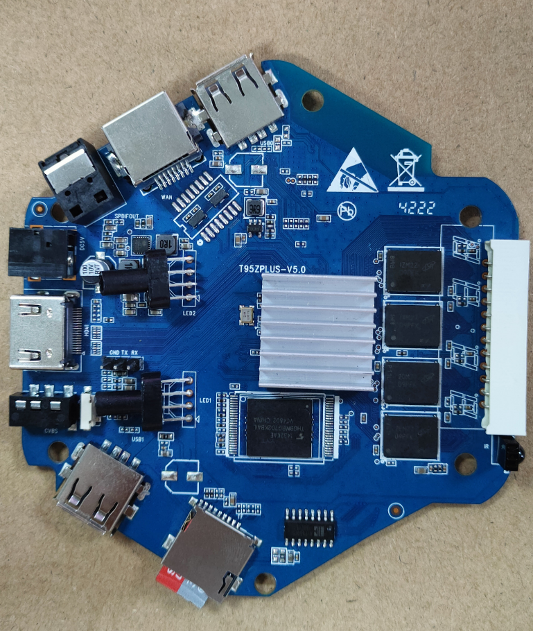
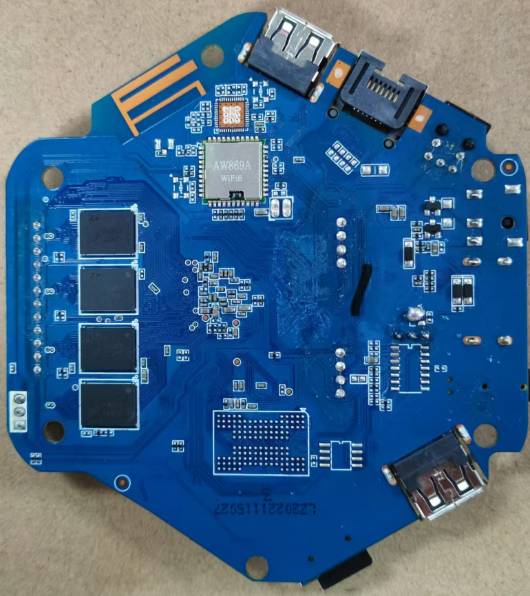

**WIFI 蓝牙编译驱动**

使用的设备板为**T95ZPLUS  H618 2+16G WIFI:AW869A** 






系统为armbian 6.7.12内核，armbian镜像见下方链接，该镜像需要修改wifi蓝牙设备树，其他设备按需修改即可

```c
mmc@4021000 {
			compatible = "allwinner,sun50i-h616-mmc\0allwinner,sun50i-a100-mmc";
			reg = <0x4021000 0x1000>;
			clocks = <0x02 0x40 0x02 0x3d>;
			clock-names = "ahb\0mmc";
			resets = <0x02 0x0f>;
			reset-names = "ahb";
			interrupts = <0x00 0x24 0x04>;
			pinctrl-names = "default";
			pinctrl-0 = <0x15>;
			status = "okay";
			max-frequency = <50000000>;
			mmc-ddr-1_8v;
			no-sd;
			no-mmc;
			cap-sdio-irq;
			#address-cells = <1>;
			#size-cells = <0>;
			mmc-pwrseq = <0x16>;
			phandle = <0x54>;
			bus-width = <0x04>;
			non-removable;
			vmmc-supply = <0x12>;
			vqmmc-supply = <0x11>;
		};

rfkill {
        compatible = "allwinner,sunxi-rfkill";
        status = "okay";
        chip_en;
        power_en;
        pinctrl-0;
        pinctrl-names;
        clocks;
        phandle = <0xd2>;

            wlan {
                compatible = "allwinner,sunxi-wlan";
                wlan_busnum = <0x01>;
                wlan_power;
                wlan_regon = <&pio 0x06 0x12 0>;
                wlan_hostwake = <&pio 0x06 0x0f 0>;
                wakeup-source;
                phandle = <0xd3>;
            };

            bt {
                compatible = "allwinner,sunxi-bt";
                bt_power;
                bt_rst_n = <&pio 0x06 0x13 1>;
                phandle = <0xd4>;
            };
        };
        
        btlpm {
            compatible = "allwinner,sunxi-btlpm";
            status = "okay";
            uart_index = <0x01>;
            bt_wake = <&pio 0x06 0x11 0>;
            bt_hostwake = <&pio 0x06 0x10 0>;
            wakeup-source;
            phandle = <0xd6>;
        };
```


在设备板上使用dkms编译驱动，编译完成后启动自动加载wifi驱动。(在板上编译需要使用armbian-config 安装linux-header, 请自行查找armbian安装linux-header教程)

```shell
sudo apt install dkms 

git clone https://github.com/LYU4662/aic8800-sdio-linux-1.0.git 

sudo cp -r aic8800-sdio-linux-1.0 /usr/src/aic8800-sdio-linux-1.0 

sudo cp -r aic8800-sdio-linux-1.0/firmware/*  /usr/lib/firmware/ 

cd /usr/src/

chmod 777 -R aic8800-sdio-linux-1.0/

sudo dkms add -m aic8800-sdio-linux -v 1.0 

sudo dkms build -m aic8800-sdio-linux -v 1.0 

sudo dkms install -m aic8800-sdio-linux -v 1.0
```

但是不会自动加载蓝牙驱动，所以要添加蓝牙驱动加载部分。

```sh
cd /etc/modules-load.d/ 

echo "aic8800_btlpm" > aic8800.conf
```

添加好后蓝牙驱动加载，但是HCI找不到设备  rfkill能看到有蓝牙控制的部分。

输入如下命令，输入后则能在HCI找到设备

`/usr/bin/hciattach -s 1500000 /dev/ttyS1 any 1500000 flow nosleep &`

bluetoothctl也可以正常使用。但是启动后会消失该配置，所以要在启动脚本中添加这条命令，我使用的是armbian，则修改/etc/rc.local

```sh
vim /etc/rc.loacl
```

修改里面的内容如下

```sh
#!/bin/sh -e
#
# rc.local
#
# This script is executed at the end of each multiuser runlevel.
# Make sure that the script will "exit 0" on success or any other
# value on error.
#
# In order to enable or disable this script just change the execution
# bits.
#
# By default this script does nothing.

/usr/bin/hciattach -s 1500000 /dev/ttyS1 any 1500000 flow nosleep &
sleep 1   #如需要蓝牙音频要下载pulseaudio 并开机启动
pulseaudio --start # 同上
exit 0
```

至此蓝牙wifi都能正常工作！


参考 & 感谢

https://github.com/radxa-pkg/aic8800.git

https://github.com/0x754C/aic8800-sdio-linux.git

https://github.com/NickAlilovic/build.git